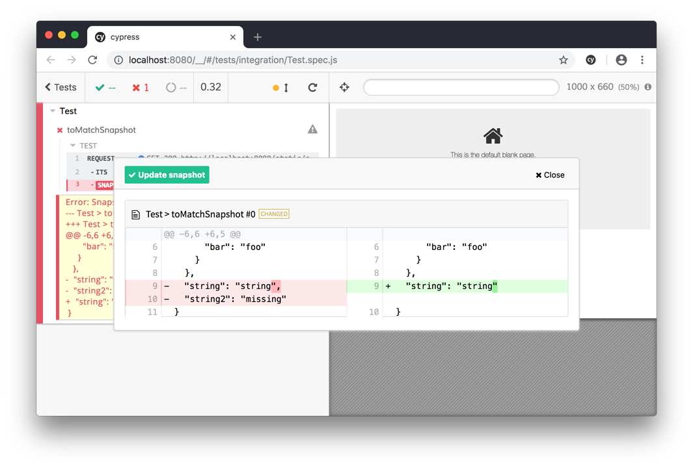

# cypress-plugin-snapshots
> Plugin for snapshot tests in [Cypress.io](https://www.cypress.io/).

[![NPM][npm-icon]][npm-url]

[![Build status][ci-image]][ci-url]



## Installation
`npm i cypress-plugin-snapshots -S`

## Usage for text snapshots
```javascript
describe('data test', () => {
  it('toMatchSnapshot - JSON', () => {
    return cy.request('data.json')
      .its('body')
      .toMatchSnapshot();
  });

  it('toMatchSnapshot - JSON with options', () => {
    return cy.request('data.json')
      .its('body')
      .toMatchSnapshot({
        ignoreExtraFields: true,
      });
  });

  it('toMatchSnapshot - HTML', () => {
    cy.visit('page.html')
      .then(() => {
        cy.get('div').toMatchSnapshot();
      });
  });
});
```

You can pass the following options to `toMatchSnapshot` to override default behavior.
```javascript
{
  "ignoreExtraFields": false,         // Ignore fields that are not in snapshot
  "ignoreExtraArrayItems": false,     // Ignore if there are extra array items in result
  "normalizeJson": true,              // Alphabetically sort keys in JSON
  "replace": {                        // Replace `${key}` in snapshot with `value`.
    "key": "value",
  }
}
```

**`replace`**
Use `replace` with caution. Tests should be deterministic. It's often a better solution to influence your
test result instead of your snapshot (by mocking data for example).

## Usage for image snapshots
```javascript
it('toMatchImageSnapshot - element', () => {
  cy.visit('/static/stub.html')
    .then(() => {
      cy.get('[data-test=test]')
        .toMatchImageSnapshot();
    });
});

it('toMatchImageSnapshot - whole page', () => {
  cy.visit('/static/stub.html')
    .then(() => {
      cy.document()
        .toMatchImageSnapshot();
    });
});
```

You can pass the following options to `toMatchImageSnapshot` to override default behavior.
```javascript
{
  "createDiffImage": true,       // Should a "diff image" be created, can be disabled for performance
  "threshold": 0.01,             // Amount in pixels or percentage before snapshot image is invalid
  "name": "custom image name",   // Naming resulting image file with a custom name rather than concatenating test titles
  "thresholdType": "percent",    // Can be either "pixel" or "percent"
}
```

You can also use any option from the `cypress.screenshot` [arguments list](https://docs.cypress.io/api/commands/screenshot.html#Arguments).

For example:
```javascript
cy.get('.element')
  .toMatchImageSnapshot({
    clip: { x: 0, y: 0, width: 100, height: 100 },
  });
```

## Configure Cypress.io
Add this to your `cypress.json` configuration file:
```json
"ignoreTestFiles": [
  "**/__snapshots__/*",
  "**/__image_snapshots__/*"
]
```

### Plugin
Find your `cypress/plugins/index.js` file and change it to look like this:

```javascript
const { initPlugin } = require('cypress-plugin-snapshots/plugin');

module.exports = (on, config) => {
  initPlugin(on, config);
  return config;
};
```

### Command
Find your `cypress/support/index.js` file and add the following line:

```javascript
import 'cypress-plugin-snapshots/commands';
```

### Make changes to default configuration
You can customize the configuration in the `cypress.json` file in the root of your Cypress project.

Add the configuration below to your `cypress.json` file to make changes to the default values.

```javascript
"env": {
  "cypress-plugin-snapshots": {
    "autoCleanUp": false,            // Automatically remove snapshots that are not used by test
    "autopassNewSnapshots": true,    // Automatically save & pass new/non-existing snapshots
    "diffLines": 3,                  // How many lines to include in the diff modal
    "excludeFields": [],             // Array of fieldnames that should be excluded from snapshot
    "ignoreExtraArrayItems": false,  // Ignore if there are extra array items in result
    "ignoreExtraFields": false,      // Ignore extra fields that are not in `snapshot`
    "normalizeJson": true,           // Alphabetically sort keys in JSON
    "prettier": true,                // Enable `prettier` for formatting HTML before comparison
    "imageConfig": {
      "createDiffImage": true,       // Should a "diff image" be created, can be disabled for performance
      "resizeDevicePixelRatio": true,// Resize image to base resolution when Cypress is running on high DPI screen, `cypress run` always runs on base resolution
      "threshold": 0.01,             // Amount in pixels or percentage before snapshot image is invalid
      "thresholdType": "percent"     // Can be either "pixels" or "percent"
    },
    "screenshotConfig": {            // See https://docs.cypress.io/api/commands/screenshot.html#Arguments
      "blackout": [],
      "capture": 'fullPage',
      "clip": null,
      "disableTimersAndAnimations": true,
      "log": false,
      "scale": false,
      "timeout": 30000,
    },
    "serverEnabled": true,           // Enable "update snapshot" server and button in diff modal
    "serverHost": "localhost",       // Hostname for "update snapshot server"
    "serverPort": 2121,              // Port number for  "update snapshot server"
    "updateSnapshots": false,        // Automatically update snapshots, useful if you have lots of changes
    "backgroundBlend": "difference", // background-blend-mode for diff image, useful to switch to "overlay" 
  }
}
```

## Caveats :warning:
There is currently an issue when running "All Tests" in Cypress with this plugin. You can follow the progress on the issue [here](https://github.com/meinaart/cypress-plugin-snapshots/issues/10) and [here](https://github.com/cypress-io/cypress/issues/3090). When running "All Tests" any tests that utilize `cypress-plugin-snapshots` will throw an error.

## Roadmap
Below is a list of functionality that is under consideration for implementing in a next version.

- Fix handling of "update snapshot" button that contains a replacable field
- Disable "update snapshots" server in headless mode
- Add more unit tests
- Add [JSDoc](http://usejsdoc.org/) documentation
- Improve TypeScript bindings

## Contributing
In lieu of a formal styleguide, take care to maintain the existing coding style.

## License
This plugin is released under the MIT license.

[npm-icon]: https://nodei.co/npm/cypress-plugin-snapshots.svg?downloads=true
[npm-url]: https://npmjs.org/package/cypress-plugin-snapshots
[ci-image]: https://travis-ci.org/meinaart/cypress-plugin-snapshots.svg?branch=master
[ci-url]: https://travis-ci.org/meinaart/cypress-plugin-snapshots
